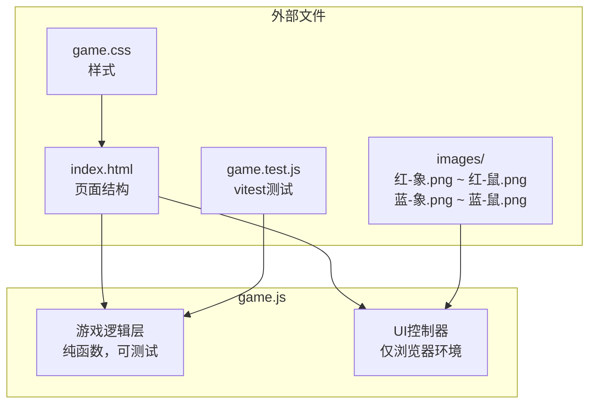

# 设计文档：兽棋游戏

## 概述

兽棋是一款基于4×4棋盘的双人策略卡牌游戏。红方和蓝方各持8张棋子（象、狮、虎、豹、狼、狗、猫、鼠各一张，共16张），随机背面朝上摆放在16个交叉点上（初始无空位）。玩家通过翻牌、走牌、吃牌等操作，利用棋子等级循环克制关系消灭对方所有棋子以获胜。

核心规则特点：
- 等级从高到低：象(1) > 狮(2) > 虎(3) > 豹(4) > 狼(5) > 狗(6) > 猫(7) > 鼠(8)
- 高等级吃低等级（跨阵营比较等级数值，数值小=等级高）
- 同级棋子相遇同归于尽
- 逆袭规则：鼠(等级8)可吃象(等级1)（鼠钻象鼻）
- 象(等级1)不能吃鼠(等级8)（被逆袭克制）
- 同阵营棋子不能互吃

技术实现参考龙虎斗游戏的架构模式：纯 HTML/CSS/JS 实现，game.js 导出纯函数供 vitest 测试，UI 控制器仅在浏览器环境运行。

文件部署在 `apps/card-game/animal-chess/` 目录下。

## 架构

### 整体架构

采用与龙虎斗相同的单文件游戏逻辑 + UI 控制器模式：



### 分层设计

1. **游戏逻辑层**（game.js 上半部分）：纯函数，无 DOM 依赖，通过 `module.exports` 导出
   - 常量定义（棋子列表、等级映射、图片映射）
   - 状态创建函数（createGameState）
   - 操作函数（flipCard, moveCard, captureCard）
   - 判定函数（canCapture, checkGameOver, hasAnyLegalAction）
   - AI 决策函数（aiDecide）

2. **UI 控制器层**（game.js 下半部分）：仅在 `typeof document !== 'undefined'` 时运行
   - 渲染器（renderBoard, updateStatus）
   - 事件处理（棋盘点击、模式选择、石头剪刀布）
   - AI 操作执行与动画

3. **样式层**（game.css）：响应式布局，支持移动端

4. **页面层**（index.html）：静态 HTML 结构

## 组件与接口

### 常量定义

```javascript
// 红方8张棋子（等级1-8，数值越小等级越高）
const RED_PIECES = ['象', '狮', '虎', '豹', '狼', '狗', '猫', '鼠'];

// 蓝方8张棋子（等级1-8）
const BLUE_PIECES = ['象', '狮', '虎', '豹', '狼', '狗', '猫', '鼠'];

// 所有动物名称（红蓝共用）
const ANIMAL_NAMES = ['象', '狮', '虎', '豹', '狼', '狗', '猫', '鼠'];

// 等级映射：动物名 → 等级数值（1最高，8最低）
const RANK_MAP = {
  '象': 1, '狮': 2, '虎': 3, '豹': 4,
  '狼': 5, '狗': 6, '猫': 7, '鼠': 8
};

// 图片映射：根据阵营和动物名生成图片文件名
// 红方：红-象.png, 红-狮.png, ..., 红-鼠.png
// 蓝方：蓝-象.png, 蓝-狮.png, ..., 蓝-鼠.png
// 通过函数 getImagePath(team, animal) 动态生成
```

### 核心函数接口

```javascript
/**
 * 获取棋子图片路径
 * @param {string} team - 阵营 'red' | 'blue'
 * @param {string} animal - 动物名称 如 '象', '鼠'
 * @returns {string} 图片路径 如 'images/红-象.png'
 */
function getImagePath(team, animal) {}

/**
 * 获取棋子等级
 * @param {string} animal - 动物名称
 * @returns {number} 等级数值 1-8
 */
function getRank(animal) {}

/**
 * 石头剪刀布判定
 * @param {string} choice1 - 'rock' | 'scissors' | 'paper'
 * @param {string} choice2 - 'rock' | 'scissors' | 'paper'
 * @returns {number} 1=第一方胜, -1=第二方胜, 0=平局
 */
function judgeRPS(choice1, choice2) {}

/**
 * 判断坐标是否在棋盘范围内
 * @param {number} x
 * @param {number} y
 * @returns {boolean}
 */
function inBounds(x, y) {}

/**
 * 判断攻击方棋子是否可以吃掉防守方棋子
 * 规则：
 * 1. 必须是不同阵营
 * 2. 高等级（数值小）吃低等级（数值大）
 * 3. 同级同归于尽（canCapture返回true，同归于尽在captureCard中处理）
 * 4. 逆袭：鼠(等级8)吃对方象(等级1)
 * 5. 象(等级1)不能吃对方鼠(等级8)（被逆袭克制）
 * @param {Card} attacker - 攻击方棋子
 * @param {Card} defender - 防守方棋子
 * @returns {boolean} 是否可以吃
 */
function canCapture(attacker, defender) {}

/**
 * 判断吃牌后是否同归于尽
 * @param {Card} attacker - 攻击方棋子
 * @param {Card} defender - 防守方棋子
 * @returns {boolean} 是否同归于尽
 */
function isMutualDestruction(attacker, defender) {}

/**
 * 创建初始游戏状态
 * @param {string} mode - 'pvp' | 'pve'
 * @returns {GameState}
 */
function createGameState(mode) {}

/**
 * 获取合法移动目标（相邻空位）
 * @param {Board} board - 棋盘
 * @param {number} x - 棋子x坐标
 * @param {number} y - 棋子y坐标
 * @returns {Array<{x, y}>}
 */
function getValidMoves(board, x, y) {}

/**
 * 获取合法吃牌目标
 * @param {Board} board - 棋盘
 * @param {number} x - 棋子x坐标
 * @param {number} y - 棋子y坐标
 * @param {string} team - 当前阵营 'red' | 'blue'
 * @returns {Array<{x, y}>}
 */
function getValidCaptures(board, x, y, team) {}

/**
 * 执行翻牌操作（就地修改state）
 * @param {GameState} state
 * @param {number} x
 * @param {number} y
 * @returns {GameState|null}
 */
function flipCard(state, x, y) {}

/**
 * 执行走牌操作（就地修改state）
 * @param {GameState} state
 * @param {{x,y}} from
 * @param {{x,y}} to
 * @returns {GameState|null}
 */
function moveCard(state, from, to) {}

/**
 * 执行吃牌操作（就地修改state）
 * 处理同归于尽：同级棋子相遇时双方均被移除
 * @param {GameState} state
 * @param {{x,y}} from
 * @param {{x,y}} to
 * @returns {GameState|null}
 */
function captureCard(state, from, to) {}

/**
 * 检查指定阵营是否有任何合法操作
 * @param {Board} board
 * @param {string} team - 'red' | 'blue'
 * @returns {boolean}
 */
function hasAnyLegalAction(board, team) {}

/**
 * 检查游戏是否结束
 * @param {Board} board
 * @param {string} currentTeam - 'red' | 'blue'
 * @returns {{ended: boolean, winner: string|null}}
 */
function checkGameOver(board, currentTeam) {}

/**
 * AI决策：选择最优操作
 * 优先级：吃牌（优先吃高等级）> 翻牌（随机）> 走牌（随机）
 * @param {GameState} state
 * @param {string} aiTeam - 'red' | 'blue'
 * @returns {{type, from?, to?, x?, y?}|null}
 */
function aiDecide(state, aiTeam) {}
```

### 模块导出

```javascript
if (typeof module !== 'undefined' && module.exports) {
  module.exports = {
    ANIMAL_NAMES, RANK_MAP,
    getImagePath, getRank, judgeRPS, inBounds,
    canCapture, isMutualDestruction,
    createGameState, getValidMoves, getValidCaptures,
    flipCard, moveCard, captureCard,
    hasAnyLegalAction, checkGameOver, aiDecide
  };
}
```

## 数据模型

### Card（棋子）

```javascript
{
  animal: string,   // 动物名称，如 '象', '鼠'
  team: string,     // 阵营 'red' | 'blue'
  rank: number,     // 等级 1-8（1最高）
  faceUp: boolean   // 是否正面朝上
}
```

### GameState（游戏状态）

```javascript
{
  mode: string,           // 'pvp' | 'pve'
  board: (Card|null)[][],  // 4×4棋盘，board[y][x]
  currentTeam: string|null, // 当前行动方 'red' | 'blue' | null
  playerTeam: string|null,  // PVE模式下玩家阵营
  aiTeam: string|null,      // PVE模式下AI阵营
  teamAssigned: boolean,    // 阵营是否已分配
  firstPlayer: string|null, // 先手阵营
  turnCount: number,        // 回合数
  capturedRed: string[],    // 红方被吃的棋子名称列表（动物名）
  capturedBlue: string[],   // 蓝方被吃的棋子名称列表（动物名）
  selectedCell: {x,y}|null, // 当前选中的格子
  gameOver: boolean,        // 游戏是否结束
  winner: string|null,      // 获胜方 'red' | 'blue' | null
  aiThinking: boolean,      // AI是否正在思考
  aiFirst: boolean          // AI是否先手
}
```

### 等级吃子关系矩阵

| 攻击方等级 | 防守方等级 | 结果 |
|-----------|-----------|------|
| 象(1) | 狮(2)~猫(7) | 吃掉 |
| 象(1) | 鼠(8) | **不能吃**（被逆袭克制） |
| 象(1) | 象(1) | 同归于尽 |
| 狮(2) | 虎(3)~鼠(8) | 吃掉 |
| 狮(2) | 象(1) | 不能吃 |
| 狮(2) | 狮(2) | 同归于尽 |
| ... | ... | ... |
| 猫(7) | 鼠(8) | 吃掉 |
| 猫(7) | 象(1)~狗(6) | 不能吃 |
| 猫(7) | 猫(7) | 同归于尽 |
| 鼠(8) | 象(1) | **逆袭吃掉**（鼠钻象鼻） |
| 鼠(8) | 狮(2)~猫(7) | 不能吃 |
| 鼠(8) | 鼠(8) | 同归于尽 |

关键约束：
- 吃牌只能发生在不同阵营之间（红吃蓝、蓝吃红）
- 同阵营棋子不能互吃
- 红蓝双方使用相同的等级体系和动物名称

### canCapture 判定逻辑

```
function canCapture(attacker, defender):
  if attacker.team == defender.team: return false  // 同阵营不能吃
  
  attRank = attacker.rank
  defRank = defender.rank
  
  // 逆袭规则：鼠(等级8)吃对方象(等级1)
  if attRank == 8 and defRank == 1: return true
  
  // 象(等级1)不能吃对方鼠(等级8)（被逆袭克制）
  if attRank == 1 and defRank == 8: return false
  
  // 高等级（数值小）吃低等级（数值大），或同级
  if attRank <= defRank: return true
  
  return false
```

### isMutualDestruction 判定逻辑

```
function isMutualDestruction(attacker, defender):
  // 同级同归于尽
  return attacker.rank == defender.rank
```


## 正确性属性

*属性（Property）是在系统所有有效执行中都应成立的特征或行为——本质上是关于系统应该做什么的形式化陈述。属性是人类可读规范与机器可验证正确性保证之间的桥梁。*

### Property 1: 初始状态不变量

*For any* 游戏模式（'pvp' 或 'pve'），createGameState 创建的初始状态应满足：棋盘为4×4，包含恰好16张非空棋子，其中红方8张（象、狮、虎、豹、狼、狗、猫、鼠各一张）、蓝方8张（象、狮、虎、豹、狼、狗、猫、鼠各一张），且所有棋子 faceUp 为 false。

**Validates: Requirements 1.1, 1.2, 1.4, 1.5, 11.1**

### Property 2: 等级映射正确性

*For any* 动物名称，getRank 应返回正确的等级值（1-8）。象=1, 狮=2, 虎=3, 豹=4, 狼=5, 狗=6, 猫=7, 鼠=8。红蓝双方使用相同的等级体系。

**Validates: Requirements 6.1**

### Property 3: 图片路径映射正确性

*For any* 阵营（'red' 或 'blue'）和动物名称，getImagePath 应返回格式为 `images/{颜色}-{动物}.png` 的路径，其中红方颜色为"红"，蓝方颜色为"蓝"。

**Validates: Requirements 3.2, 9.1**

### Property 4: 吃子规则完整性

*For any* 两张不同阵营的棋子 A（等级 rA）和 B（等级 rB），canCapture(A, B) 应满足：
- 若 rA < rB 且 !(rA==1 && rB==8)：返回 true（高等级吃低等级）
- 若 rA == rB：返回 true（同级可吃，同归于尽在 captureCard 中处理）
- 若 rA == 8 且 rB == 1：返回 true（逆袭规则：鼠吃象）
- 若 rA == 1 且 rB == 8：返回 false（象不能吃鼠，被逆袭克制）
- 若 rA > rB 且 !(rA==8 && rB==1)：返回 false（低等级不能吃高等级）
- 同阵营棋子：始终返回 false

**Validates: Requirements 5.1, 5.4, 5.7, 6.2, 6.3, 6.4, 6.5, 6.6, 6.7**

### Property 5: 吃牌结果正确性

*For any* 合法的吃牌操作，captureCard 执行后：
- 若攻击方与防守方同级（isMutualDestruction 为 true）：攻击方和防守方位置均变为 null，双方棋子均加入各自的被吃列表
- 若非同级：攻击方移动到防守方位置，攻击方原位置变为 null，防守方棋子加入被吃列表

**Validates: Requirements 5.2, 5.3**

### Property 6: 操作后回合切换

*For any* 合法的翻牌、走牌或吃牌操作，执行后 currentTeam 应从 'red' 切换为 'blue'，或从 'blue' 切换为 'red'，且 turnCount 递增 1。

**Validates: Requirements 3.3, 4.4, 5.5, 8.2**

### Property 7: 非法操作拒绝

*For any* 操作尝试，若满足以下任一条件则应返回 null：
- moveCard/captureCard：操作的棋子不属于当前行动方
- moveCard/captureCard：操作的棋子未翻开（faceUp 为 false）
- moveCard/captureCard：起始位置与目标位置的曼哈顿距离不为 1
- moveCard：目标位置非空
- captureCard：目标位置为空、未翻开、或为同阵营棋子
- flipCard：目标位置为空或已翻开

**Validates: Requirements 4.2, 4.5, 4.6, 5.6, 8.4**

### Property 8: 游戏结束判定

*For any* 棋盘状态，checkGameOver 应满足：
- 若一方棋子数量为 0，则该方失败，对方获胜
- 若当前行动方无任何合法操作（hasAnyLegalAction 返回 false），则当前行动方失败
- 若双方均有棋子且当前行动方有合法操作，则游戏未结束

**Validates: Requirements 7.1, 7.2**

### Property 9: PVE 首次翻牌阵营分配

*For any* PVE 模式下的首次翻牌操作，若玩家先手，翻开的棋子所属阵营应被分配给玩家（playerTeam），对方阵营分配给 AI（aiTeam）；若 AI 先手，翻开的棋子所属阵营应被分配给 AI（aiTeam），对方阵营分配给玩家（playerTeam）。

**Validates: Requirements 11.2, 11.4**

### Property 10: AI 决策合法性

*For any* 游戏状态（AI 回合且有合法操作），aiDecide 返回的决策应满足：
- 返回的操作类型为 'flip'、'move' 或 'capture' 之一
- 若存在合法吃牌操作，则必须返回 'capture' 类型
- 返回的操作应用到游戏状态后不返回 null（即操作合法）

**Validates: Requirements 13.1, 13.2, 13.5**

## 错误处理

### 非法操作处理

| 错误场景 | 处理方式 |
|---------|---------|
| 点击空位（无棋子） | flipCard 返回 null，UI 忽略 |
| 点击已翻开的棋子尝试翻牌 | flipCard 返回 null，UI 忽略 |
| 移动到非空位置 | moveCard 返回 null，UI 显示提示 |
| 移动到非相邻位置 | moveCard 返回 null，UI 显示提示 |
| 移动对方棋子 | moveCard 返回 null，UI 显示"这不是你的棋子" |
| 吃不满足等级规则的棋子 | captureCard 返回 null，UI 显示"无法吃掉该棋子" |
| 吃同阵营棋子 | captureCard 返回 null，UI 忽略 |
| 吃未翻开的棋子 | captureCard 返回 null，UI 忽略 |
| 坐标越界 | inBounds 检查，返回 null |
| AI 无合法操作 | aiDecide 返回 null，触发游戏结束判定 |

### 边界条件

- 初始状态棋盘满（16张棋子，无空位）：走牌不可用，只能翻牌
- 所有棋子已翻开且无空位：只能吃牌
- 同归于尽产生两个空位：后续走牌有更多选择
- AI 先手时首次翻牌的阵营分配逻辑

## 测试策略

### 测试框架

- 使用 vitest 作为测试框架（项目已配置）
- 使用 fast-check 作为属性测试库（项目已安装）
- 测试文件：`apps/card-game/animal-chess/game.test.js`

### 双重测试方法

**单元测试（Example-based）**：
- 石头剪刀布 9 种组合穷举
- 图片映射 16 种棋子验证（红蓝各8种动物）
- 具体的吃子场景（逆袭：鼠吃象、象不能吃鼠、同归于尽等）
- createGameState 初始状态验证
- getValidMoves 各种位置场景
- getValidCaptures 各种吃牌场景
- flipCard 翻牌操作各种场景
- moveCard 走牌操作各种场景
- captureCard 吃牌操作各种场景（含同归于尽）
- hasAnyLegalAction 合法操作检测
- checkGameOver 游戏结束判定
- aiDecide AI 决策各种优先级场景

**属性测试（Property-based）**：
- 使用 fast-check 库
- 每个属性测试最少运行 100 次迭代
- 每个测试用注释标注对应的设计文档属性
- 标注格式：`Feature: animal-chess-game, Property {number}: {property_text}`

### 属性测试生成器设计

```javascript
// 生成随机动物名称
const arbAnimal = fc.constantFrom('象', '狮', '虎', '豹', '狼', '狗', '猫', '鼠');

// 生成随机阵营
const arbTeam = fc.constantFrom('red', 'blue');

// 生成随机棋盘坐标
const arbCoord = fc.record({ x: fc.integer({ min: 0, max: 3 }), y: fc.integer({ min: 0, max: 3 }) });

// 生成随机游戏模式
const arbMode = fc.constantFrom('pvp', 'pve');

// 生成随机棋子对象
const arbCard = fc.record({
  animal: arbAnimal,
  team: arbTeam,
  rank: fc.integer({ min: 1, max: 8 }),
  faceUp: fc.boolean()
});

// 生成跨阵营棋子对（用于测试 canCapture）
const arbCrossTeamPair = fc.tuple(
  fc.record({ animal: arbAnimal, team: fc.constant('red'), rank: fc.integer({ min: 1, max: 8 }), faceUp: fc.constant(true) }),
  fc.record({ animal: arbAnimal, team: fc.constant('blue'), rank: fc.integer({ min: 1, max: 8 }), faceUp: fc.constant(true) })
);
```

### 测试覆盖范围

| 属性编号 | 属性名称 | 测试类型 |
|---------|---------|---------|
| Property 1 | 初始状态不变量 | 属性测试 |
| Property 2 | 等级映射正确性 | 属性测试 |
| Property 3 | 图片路径映射正确性 | 属性测试 |
| Property 4 | 吃子规则完整性 | 属性测试 |
| Property 5 | 吃牌结果正确性 | 属性测试 |
| Property 6 | 操作后回合切换 | 属性测试 |
| Property 7 | 非法操作拒绝 | 属性测试 + 单元测试 |
| Property 8 | 游戏结束判定 | 属性测试 |
| Property 9 | PVE 首次翻牌阵营分配 | 属性测试 |
| Property 10 | AI 决策合法性 | 属性测试 |
