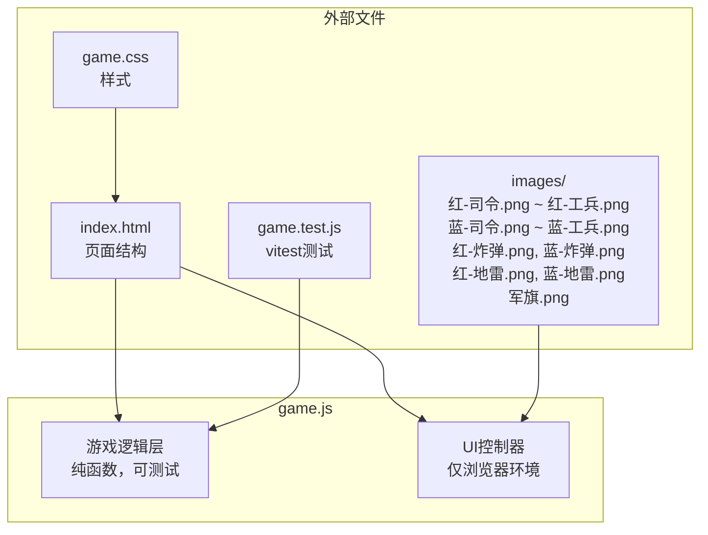

# 设计文档：军棋（翻翻棋）

## 概述

军棋（翻翻棋）是一款基于5×5棋盘的双人策略卡牌游戏。红蓝双方各持12张棋子（司令、军长、师长、旅长、团长、营长、连长、排长、班长、工兵、炸弹、地雷各一张），加上1张中立军旗，共25张棋子随机背面朝上摆放在5×5棋盘的25个交叉点上（无空位）。玩家通过翻牌、走牌、吃牌等操作，利用棋子等级高低关系和特殊棋子规则进行对弈。

核心规则特点：
- 等级从高到低：司令(1) > 军长(2) > 师长(3) > 旅长(4) > 团长(5) > 营长(6) > 连长(7) > 排长(8) > 班长(9) > 工兵(10)
- 高等级吃低等级（跨阵营比较等级数值，数值小=等级高）
- 同级棋子相遇同归于尽
- 炸弹：可移动，碰任何棋子（除军旗）同归于尽
- 地雷：不可移动，工兵吃地雷（工兵存活），其他普通棋子碰地雷同归于尽，炸弹碰地雷同归于尽
- 军旗：中立，不可移动，不可被吃，只能被己方最小普通棋子"抱"
- 胜利条件：己方最小普通棋子移动到军旗位置（抱军旗），或对方无合法操作

技术实现参考龙虎斗/兽棋游戏的架构模式：纯 HTML/CSS/JS 实现，game.js 导出纯函数供 vitest 测试，UI 控制器仅在浏览器环境运行。

文件部署在 `apps/card-game/chinese-army-chess/` 目录下。

## 架构

### 整体架构

采用与龙虎斗/兽棋相同的单文件游戏逻辑 + UI 控制器模式：



### 分层设计

1. **游戏逻辑层**（game.js 上半部分）：纯函数，无 DOM 依赖，通过 `module.exports` 导出
   - 常量定义（棋子列表、等级映射、图片映射、棋子类型分类）
   - 状态创建函数（createGameState）
   - 操作函数（flipCard, moveCard, captureCard）
   - 判定函数（canCapture, resolveCombat, canCaptureFlag, getLowestNormalPiece, checkGameOver, hasAnyLegalAction）
   - AI 决策函数（aiDecide）

2. **UI 控制器层**（game.js 下半部分）：仅在 `typeof document !== 'undefined'` 时运行
   - 渲染器（renderBoard, updateStatus）
   - 事件处理（棋盘点击、模式选择、石头剪刀布）
   - AI 操作执行与动画

3. **样式层**（game.css）：响应式布局，支持移动端

4. **页面层**（index.html）：静态 HTML 结构，5×5 棋盘网格

## 组件与接口

### 常量定义

```javascript
// 普通棋子名称列表（等级1-10，数值越小等级越高）
const NORMAL_PIECE_NAMES = ['司令', '军长', '师长', '旅长', '团长', '营长', '连长', '排长', '班长', '工兵'];

// 特殊棋子名称
const BOMB_NAME = '炸弹';
const MINE_NAME = '地雷';
const FLAG_NAME = '军旗';

// 每方棋子名称列表（12张：10普通 + 炸弹 + 地雷）
const TEAM_PIECE_NAMES = [...NORMAL_PIECE_NAMES, BOMB_NAME, MINE_NAME];

// 等级映射：棋子名 → 等级数值（1最高，10最低；炸弹/地雷/军旗不参与等级排序）
const RANK_MAP = {
  '司令': 1, '军长': 2, '师长': 3, '旅长': 4, '团长': 5,
  '营长': 6, '连长': 7, '排长': 8, '班长': 9, '工兵': 10
};

// 棋子类型判定
function isNormalPiece(name) {}  // 是否为普通棋子（参与等级排序的10种）
function isBomb(name) {}         // 是否为炸弹
function isMine(name) {}         // 是否为地雷
function isFlag(name) {}         // 是否为军旗
function isMovable(piece) {}     // 是否可移动（地雷和军旗不可移动）
```

### 核心函数接口

```javascript
/**
 * 获取棋子图片路径
 * @param {Piece} piece - 棋子对象
 * @returns {string} 图片路径，如 'images/红-司令.png'、'images/军旗.png'
 */
function getImagePath(piece) {}

/**
 * 获取棋子等级（仅普通棋子有等级）
 * @param {string} name - 棋子名称
 * @returns {number|null} 等级数值 1-10，非普通棋子返回 null
 */
function getRank(name) {}

/**
 * 石头剪刀布判定
 * @param {string} choice1 - 'rock' | 'scissors' | 'paper'
 * @param {string} choice2 - 'rock' | 'scissors' | 'paper'
 * @returns {number} 1=第一方胜, -1=第二方胜, 0=平局
 */
function judgeRPS(choice1, choice2) {}

/**
 * 判断坐标是否在5×5棋盘范围内
 * @param {number} x - 0~4
 * @param {number} y - 0~4
 * @returns {boolean}
 */
function inBounds(x, y) {}

/**
 * 判断攻击方棋子是否可以对目标棋子发起吃牌/碰撞操作
 * 综合规则：
 * 1. 必须是不同阵营（军旗视为不同阵营，但不可被吃）
 * 2. 任何棋子不能吃军旗（军旗只能被"抱"）
 * 3. 地雷不能主动发起攻击
 * 4. 炸弹可以碰任何对方棋子（除军旗），结果为同归于尽
 * 5. 工兵碰地雷：工兵存活，地雷被移除
 * 6. 其他普通棋子碰地雷：同归于尽
 * 7. 炸弹碰地雷：同归于尽
 * 8. 普通棋子之间：高等级吃低等级，同级同归于尽
 * @param {Piece} attacker - 攻击方棋子
 * @param {Piece} defender - 防守方棋子
 * @returns {boolean} 是否可以发起该操作
 */
function canCapture(attacker, defender) {}

/**
 * 解析战斗结果
 * @param {Piece} attacker - 攻击方棋子
 * @param {Piece} defender - 防守方棋子
 * @returns {'attacker_wins' | 'mutual_destruction' | 'invalid'} 战斗结果
 *   - 'attacker_wins': 攻击方存活，防守方被移除
 *   - 'mutual_destruction': 双方同归于尽
 *   - 'invalid': 不合法的战斗
 */
function resolveCombat(attacker, defender) {}

/**
 * 获取指定阵营场上存活的最小普通棋子（等级数值最大的普通棋子）
 * @param {Board} board - 棋盘
 * @param {string} team - 阵营 'red' | 'blue'
 * @returns {Piece|null} 最小普通棋子，若无普通棋子则返回 null
 */
function getLowestNormalPiece(board, team) {}

/**
 * 判断指定棋子是否可以执行抱军旗操作
 * 条件：该棋子是己方场上最小普通棋子，且与军旗相邻
 * @param {Board} board - 棋盘
 * @param {number} x - 棋子x坐标
 * @param {number} y - 棋子y坐标
 * @param {string} team - 棋子所属阵营
 * @returns {{canCapture: boolean, flagX: number, flagY: number}|null}
 */
function canCaptureFlag(board, x, y, team) {}

/**
 * 创建初始游戏状态
 * @param {string} mode - 'pvp' | 'pve'
 * @returns {GameState}
 */
function createGameState(mode) {}

/**
 * 获取合法移动目标（相邻空位 + 可抱军旗的位置）
 * @param {Board} board - 棋盘
 * @param {number} x - 棋子x坐标
 * @param {number} y - 棋子y坐标
 * @param {string} team - 棋子所属阵营
 * @returns {Array<{x, y, type: 'move'|'capture_flag'}>}
 */
function getValidMoves(board, x, y, team) {}

/**
 * 获取合法吃牌目标
 * @param {Board} board - 棋盘
 * @param {number} x - 棋子x坐标
 * @param {number} y - 棋子y坐标
 * @param {string} team - 当前阵营 'red' | 'blue'
 * @returns {Array<{x, y}>}
 */
function getValidCaptures(board, x, y, team) {}

/**
 * 执行翻牌操作（就地修改state）
 * @param {GameState} state
 * @param {number} x
 * @param {number} y
 * @returns {GameState|null}
 */
function flipCard(state, x, y) {}

/**
 * 执行走牌操作（就地修改state），包含抱军旗判定
 * @param {GameState} state
 * @param {{x,y}} from
 * @param {{x,y}} to
 * @returns {GameState|null}
 */
function moveCard(state, from, to) {}

/**
 * 执行吃牌操作（就地修改state）
 * 处理：普通等级吃子、同归于尽、炸弹同归于尽、工兵排雷、普通棋子碰地雷
 * @param {GameState} state
 * @param {{x,y}} from - 攻击方位置
 * @param {{x,y}} to - 防守方位置
 * @returns {GameState|null}
 */
function captureCard(state, from, to) {}

/**
 * 检查指定阵营是否有任何合法操作（翻牌/走牌/吃牌）
 * @param {Board} board
 * @param {string} team - 'red' | 'blue'
 * @returns {boolean}
 */
function hasAnyLegalAction(board, team) {}

/**
 * 检查游戏是否结束
 * @param {GameState} state
 * @returns {{ended: boolean, winner: string|null}}
 */
function checkGameOver(state) {}

/**
 * AI决策：选择最优操作
 * 优先级：抱军旗 > 吃牌（优先吃高等级）> 翻牌（随机）> 走牌（随机）
 * @param {GameState} state
 * @param {string} aiTeam - AI阵营 'red' | 'blue'
 * @returns {{type, from?, to?, x?, y?}|null}
 */
function aiDecide(state, aiTeam) {}
```

### 模块导出

```javascript
if (typeof module !== 'undefined' && module.exports) {
  module.exports = {
    NORMAL_PIECE_NAMES, BOMB_NAME, MINE_NAME, FLAG_NAME,
    TEAM_PIECE_NAMES, RANK_MAP,
    isNormalPiece, isBomb, isMine, isFlag, isMovable,
    getImagePath, getRank, judgeRPS, inBounds,
    canCapture, resolveCombat, getLowestNormalPiece, canCaptureFlag,
    createGameState, getValidMoves, getValidCaptures,
    flipCard, moveCard, captureCard,
    hasAnyLegalAction, checkGameOver, aiDecide
  };
}
```

## 数据模型

### Piece（棋子）

```javascript
{
  name: string,     // 棋子名称，如 '司令', '炸弹', '地雷', '军旗'
  team: string,     // 阵营 'red' | 'blue' | 'neutral'（军旗为 'neutral'）
  rank: number|null,// 等级 1-10（普通棋子），null（炸弹、地雷、军旗）
  faceUp: boolean   // 是否正面朝上
}
```

### GameState（游戏状态）

```javascript
{
  mode: string,             // 'pvp' | 'pve'
  board: (Piece|null)[][],  // 5×5棋盘，board[y][x]，null 表示空位
  currentTeam: string|null, // 当前行动方 'red' | 'blue' | null
  playerTeam: string|null,  // PVE模式下玩家阵营
  aiTeam: string|null,      // PVE模式下AI阵营
  teamAssigned: boolean,    // 阵营是否已分配（第一张非军旗棋子翻开后分配）
  firstPlayer: string|null, // 先手阵营
  turnCount: number,        // 回合数
  capturedRed: string[],    // 红方被吃的棋子名称列表
  capturedBlue: string[],   // 蓝方被吃的棋子名称列表
  selectedCell: {x,y}|null, // 当前选中的格子
  gameOver: boolean,        // 游戏是否结束
  winner: string|null,      // 获胜方 'red' | 'blue' | null
  aiThinking: boolean,      // AI是否正在思考
  aiFirst: boolean          // AI是否先手
}
```

### 棋子分类

| 分类 | 棋子 | 数量(每方) | 等级 | 可移动 | 可主动攻击 |
|------|------|-----------|------|--------|-----------|
| 普通棋子 | 司令~工兵 | 各1张 | 1~10 | ✅ | ✅ |
| 炸弹 | 炸弹 | 1张 | 无 | ✅ | ✅（同归于尽） |
| 地雷 | 地雷 | 1张 | 无 | ❌ | ❌（只能被动） |
| 军旗 | 军旗 | 1张(中立) | 无 | ❌ | ❌（只能被抱） |

### 战斗结果矩阵

| 攻击方 \ 防守方 | 普通棋子(高等级) | 普通棋子(同级) | 普通棋子(低等级) | 炸弹 | 地雷 | 军旗 |
|----------------|-----------------|---------------|-----------------|------|------|------|
| 普通棋子(高等级) | — | 同归于尽 | 吃掉 | 同归于尽 | 同归于尽 | ❌不可吃 |
| 普通棋子(低等级) | ❌不可吃 | 同归于尽 | — | 同归于尽 | 同归于尽 | ❌不可吃 |
| 工兵 | ❌不可吃(若对方等级更高) | 同归于尽(工兵对工兵) | 吃掉(若对方等级更低) | 同归于尽 | **工兵存活** | ❌不可吃 |
| 炸弹 | 同归于尽 | — | 同归于尽 | 同归于尽 | 同归于尽 | ❌不可吃 |
| 地雷 | ❌不可主动攻击 | ❌ | ❌ | ❌ | ❌ | ❌ |
| 军旗 | ❌不可移动 | ❌ | ❌ | ❌ | ❌ | ❌ |

### canCapture 判定逻辑

```
function canCapture(attacker, defender):
  // 军旗不可被吃
  if defender.name == '军旗': return false
  
  // 地雷不能主动攻击
  if attacker.name == '地雷': return false
  
  // 军旗不能主动攻击
  if attacker.name == '军旗': return false
  
  // 同阵营不能互吃（军旗为neutral，不属于任何阵营，此规则不适用于军旗）
  if attacker.team == defender.team and attacker.team != 'neutral': return false
  
  // 炸弹碰任何对方棋子（除军旗，已在上面排除）→ 可以
  if attacker.name == '炸弹': return true
  
  // 任何可移动棋子碰对方炸弹 → 可以（炸弹同归于尽）
  if defender.name == '炸弹': return true
  
  // 工兵碰地雷 → 可以（工兵存活）
  if attacker.name == '工兵' and defender.name == '地雷': return true
  
  // 其他普通棋子碰地雷 → 可以（同归于尽）
  if defender.name == '地雷' and isNormalPiece(attacker.name): return true
  
  // 普通棋子之间：高等级（数值小）吃低等级（数值大），或同级
  if isNormalPiece(attacker.name) and isNormalPiece(defender.name):
    return attacker.rank <= defender.rank
  
  return false
```

### resolveCombat 结果逻辑

```
function resolveCombat(attacker, defender):
  if !canCapture(attacker, defender): return 'invalid'
  
  // 炸弹攻击 → 同归于尽
  if attacker.name == '炸弹': return 'mutual_destruction'
  
  // 被炸弹防守 → 同归于尽
  if defender.name == '炸弹': return 'mutual_destruction'
  
  // 工兵碰地雷 → 工兵存活
  if attacker.name == '工兵' and defender.name == '地雷': return 'attacker_wins'
  
  // 其他普通棋子碰地雷 → 同归于尽
  if defender.name == '地雷': return 'mutual_destruction'
  
  // 普通棋子之间
  if attacker.rank == defender.rank: return 'mutual_destruction'
  if attacker.rank < defender.rank: return 'attacker_wins'
  
  return 'invalid'  // 不应到达此处
```

### 阵营分配逻辑

```
翻牌时：
  if 翻开的是军旗:
    显示军旗，不分配阵营，等待下一张非军旗棋子
  else if 阵营未分配:
    翻牌玩家 = 该棋子所属阵营的控制方
    对手 = 另一阵营的控制方
    teamAssigned = true
```

### 抱军旗逻辑

```
function canCaptureFlag(board, x, y, team):
  piece = board[y][x]
  if piece == null or !piece.faceUp: return null
  if piece.team != team: return null
  if !isNormalPiece(piece.name): return null
  
  // 检查是否为己方最小普通棋子
  lowest = getLowestNormalPiece(board, team)
  if lowest == null or piece.name != lowest.name: return null
  
  // 检查相邻位置是否有军旗
  for each adjacent (nx, ny):
    adj = board[ny][nx]
    if adj != null and adj.name == '军旗' and adj.faceUp:
      return { canCapture: true, flagX: nx, flagY: ny }
  
  return null
```


## 正确性属性

*属性（Property）是在系统所有有效执行中都应成立的特征或行为——本质上是关于系统应该做什么的形式化陈述。属性是人类可读规范与机器可验证正确性保证之间的桥梁。*

### Property 1: 初始状态不变量

*For any* 游戏模式（'pvp' 或 'pve'），createGameState 创建的初始状态应满足：棋盘为5×5，包含恰好25张非空棋子，其中红方12张（司令、军长、师长、旅长、团长、营长、连长、排长、班长、工兵、炸弹、地雷各一张）、蓝方12张（同上）、1张中立军旗（team='neutral'），且所有棋子 faceUp 为 false。

**Validates: Requirements 1.2, 1.4, 1.5**

### Property 2: 图片路径映射正确性

*For any* 棋子对象，getImagePath 应返回正确格式的路径：红方棋子返回 `images/红-{名称}.png`，蓝方棋子返回 `images/蓝-{名称}.png`，军旗返回 `images/军旗.png`。

**Validates: Requirements 3.2, 12.1**

### Property 3: 等级映射正确性

*For any* 普通棋子名称，getRank 应返回正确的等级值（1-10）：司令=1, 军长=2, 师长=3, 旅长=4, 团长=5, 营长=6, 连长=7, 排长=8, 班长=9, 工兵=10。对于炸弹、地雷、军旗，getRank 应返回 null。

**Validates: Requirements 7.1, 7.4**

### Property 4: 战斗判定完整性（canCapture）

*For any* 两张棋子 A 和 B，canCapture(A, B) 应满足：
- 军旗作为防守方：始终返回 false（军旗不可被吃）
- 地雷作为攻击方：始终返回 false（地雷不能主动攻击）
- 同阵营棋子：始终返回 false
- 炸弹攻击非军旗对方棋子：返回 true
- 任何可移动棋子攻击对方炸弹：返回 true
- 工兵攻击对方地雷：返回 true
- 其他普通棋子攻击对方地雷：返回 true
- 普通棋子之间：攻击方等级 ≤ 防守方等级（数值比较）时返回 true，否则返回 false

**Validates: Requirements 6.1, 6.4, 6.7, 6.8, 8.2, 8.3, 8.4, 9.2, 9.3, 9.5, 10.3**

### Property 5: 战斗结果正确性（resolveCombat）

*For any* 两张可合法战斗的棋子 A 和 B（canCapture(A,B)=true），resolveCombat(A, B) 应满足：
- 炸弹攻击任何棋子：返回 'mutual_destruction'
- 任何棋子攻击炸弹：返回 'mutual_destruction'
- 工兵攻击地雷：返回 'attacker_wins'（工兵存活）
- 其他普通棋子攻击地雷：返回 'mutual_destruction'
- 炸弹攻击地雷：返回 'mutual_destruction'
- 同级普通棋子：返回 'mutual_destruction'
- 高等级普通棋子攻击低等级：返回 'attacker_wins'

**Validates: Requirements 6.2, 6.3, 8.2, 8.4, 9.2, 9.3, 9.4**

### Property 6: 操作后回合切换

*For any* 合法的翻牌、走牌或吃牌操作，执行后 currentTeam 应从 'red' 切换为 'blue'，或从 'blue' 切换为 'red'，且 turnCount 递增 1。

**Validates: Requirements 3.3, 5.4, 6.5, 11.2**

### Property 7: 非法操作拒绝

*For any* 操作尝试，若满足以下任一条件则应返回 null：
- moveCard/captureCard：操作的棋子不属于当前行动方
- moveCard/captureCard：操作的棋子未翻开（faceUp 为 false）
- moveCard/captureCard：起始位置与目标位置的曼哈顿距离不为 1
- moveCard：目标位置非空（且非军旗抱旗情况）
- moveCard：棋子为地雷或军旗（不可移动）
- captureCard：目标位置为空、未翻开、或为同阵营棋子
- flipCard：目标位置为空或已翻开
- 坐标越界

**Validates: Requirements 5.2, 5.5, 5.6, 5.7, 6.6, 11.4**

### Property 8: 抱军旗判定正确性

*For any* 棋盘状态和己方棋子，canCaptureFlag 应满足：
- 仅当该棋子是己方场上存活的等级最低的普通棋子（等级数值最大）时，才允许抱军旗
- 仅当该棋子与已翻开的军旗相邻时，才允许抱军旗
- 非普通棋子（炸弹、地雷）不能抱军旗
- 非最小普通棋子不能抱军旗

**Validates: Requirements 10.4, 10.5, 10.6**

### Property 9: 游戏结束判定

*For any* 游戏状态，checkGameOver 应满足：
- 若当前行动方无任何合法操作（hasAnyLegalAction 返回 false），则当前行动方失败，对方获胜
- 若通过抱军旗获胜（gameOver 已被 moveCard 设置），则正确返回获胜方
- 若双方均有合法操作且未抱军旗，则游戏未结束

**Validates: Requirements 10.7**

### Property 10: PVE 首次翻牌阵营分配

*For any* PVE 模式下的首次非军旗翻牌操作，若玩家先手，翻开的棋子所属阵营应被分配给玩家（playerTeam），对方阵营分配给 AI（aiTeam）；若 AI 先手，翻开的棋子所属阵营应被分配给 AI（aiTeam），对方阵营分配给玩家（playerTeam）。翻开军旗时不进行阵营分配。

**Validates: Requirements 4.2, 4.4, 4.5**

### Property 11: AI 决策合法性

*For any* 游戏状态（AI 回合且有合法操作），aiDecide 返回的决策应满足：
- 返回的操作类型为 'flip'、'move' 或 'capture' 之一
- 若存在合法吃牌操作，则必须返回 'capture' 类型（吃牌优先）
- 若AI最小普通棋子与军旗相邻，则必须返回抱军旗操作（最高优先级）
- 返回的操作应用到游戏状态后不返回 null（即操作合法）

**Validates: Requirements 15.1, 15.2, 15.5, 15.7**

## 错误处理

### 非法操作处理

| 错误场景 | 处理方式 |
|---------|---------|
| 点击空位（无棋子） | flipCard 返回 null，UI 忽略 |
| 点击已翻开的棋子尝试翻牌 | flipCard 返回 null，UI 忽略 |
| 移动到非空位置 | moveCard 返回 null，UI 显示提示 |
| 移动到非相邻位置 | moveCard 返回 null，UI 显示提示 |
| 移动对方棋子 | moveCard 返回 null，UI 显示"这不是你的棋子" |
| 移动地雷或军旗 | moveCard 返回 null，UI 显示"该棋子不能移动" |
| 吃不满足规则的棋子 | captureCard 返回 null，UI 显示"无法吃掉该棋子" |
| 低等级吃高等级 | captureCard 返回 null，UI 显示"等级不够" |
| 吃同阵营棋子 | captureCard 返回 null，UI 忽略 |
| 吃未翻开的棋子 | captureCard 返回 null，UI 忽略 |
| 吃军旗 | captureCard 返回 null，UI 显示"军旗不能被吃" |
| 非最小普通棋子尝试抱军旗 | moveCard 返回 null，UI 显示"只有最小棋子才能抱军旗" |
| 坐标越界 | inBounds 检查，返回 null |
| AI 无合法操作 | aiDecide 返回 null，触发游戏结束判定 |
| PVE 模式下非玩家回合点击 | UI 层拦截，忽略点击 |

### 边界条件

- 初始状态棋盘满（25张棋子，无空位）：走牌不可用，只能翻牌
- 所有棋子已翻开且无空位：只能吃牌
- 同归于尽产生两个空位：后续走牌有更多选择
- 第一张翻开的是军旗：不分配阵营，等待下一张非军旗棋子
- 己方仅剩炸弹和地雷（无普通棋子）：不能抱军旗
- 己方最小普通棋子变化（某棋子被吃后，最小棋子可能改变）
- AI 先手时首次翻牌的阵营分配逻辑

## 测试策略

### 测试框架

- 使用 vitest 作为测试框架（项目已配置）
- 使用 fast-check 作为属性测试库（项目已安装）
- 测试文件：`apps/card-game/chinese-army-chess/game.test.js`

### 双重测试方法

**单元测试（Example-based）**：
- 石头剪刀布 9 种组合穷举
- 图片映射 25 种棋子验证（红方12种 + 蓝方12种 + 军旗）
- 具体的吃子场景（炸弹同归于尽、工兵排雷、普通棋子碰地雷、同级同归于尽等）
- createGameState 初始状态验证
- getValidMoves 各种位置场景（含抱军旗目标）
- getValidCaptures 各种吃牌场景
- flipCard 翻牌操作各种场景（含军旗翻牌不分配阵营）
- moveCard 走牌操作各种场景（含地雷/军旗不可移动）
- captureCard 吃牌操作各种场景（含炸弹、地雷、工兵排雷）
- canCaptureFlag 抱军旗判定各种场景
- hasAnyLegalAction 合法操作检测
- checkGameOver 游戏结束判定（含抱军旗获胜）
- aiDecide AI 决策各种优先级场景（含抱军旗最高优先级）

**属性测试（Property-based）**：
- 使用 fast-check 库
- 每个属性测试最少运行 100 次迭代
- 每个测试用注释标注对应的设计文档属性
- 标注格式：`Feature: chinese-army-chess-game, Property {number}: {property_text}`

### 属性测试生成器设计

```javascript
// 生成随机普通棋子名称
const arbNormalPieceName = fc.constantFrom('司令', '军长', '师长', '旅长', '团长', '营长', '连长', '排长', '班长', '工兵');

// 生成随机棋子名称（含特殊棋子）
const arbPieceName = fc.constantFrom('司令', '军长', '师长', '旅长', '团长', '营长', '连长', '排长', '班长', '工兵', '炸弹', '地雷');

// 生成随机阵营
const arbTeam = fc.constantFrom('red', 'blue');

// 生成随机棋盘坐标（5×5）
const arbCoord = fc.record({ x: fc.integer({ min: 0, max: 4 }), y: fc.integer({ min: 0, max: 4 }) });

// 生成随机游戏模式
const arbMode = fc.constantFrom('pvp', 'pve');

// 生成随机普通棋子对象
const arbNormalPiece = fc.record({
  name: arbNormalPieceName,
  team: arbTeam,
  faceUp: fc.constant(true)
}).map(p => ({ ...p, rank: RANK_MAP[p.name] }));

// 生成跨阵营棋子对（用于测试 canCapture）
const arbCrossTeamPair = arbTeam.chain(team1 => {
  const team2 = team1 === 'red' ? 'blue' : 'red';
  return fc.tuple(
    fc.record({ name: arbPieceName, team: fc.constant(team1), faceUp: fc.constant(true) })
      .map(p => ({ ...p, rank: RANK_MAP[p.name] || null })),
    fc.record({ name: arbPieceName, team: fc.constant(team2), faceUp: fc.constant(true) })
      .map(p => ({ ...p, rank: RANK_MAP[p.name] || null }))
  );
});
```

### 测试覆盖范围

| 属性编号 | 属性名称 | 测试类型 |
|---------|---------|---------|
| Property 1 | 初始状态不变量 | 属性测试 |
| Property 2 | 图片路径映射正确性 | 属性测试 |
| Property 3 | 等级映射正确性 | 属性测试 |
| Property 4 | 战斗判定完整性 | 属性测试 |
| Property 5 | 战斗结果正确性 | 属性测试 |
| Property 6 | 操作后回合切换 | 属性测试 |
| Property 7 | 非法操作拒绝 | 属性测试 + 单元测试 |
| Property 8 | 抱军旗判定正确性 | 属性测试 |
| Property 9 | 游戏结束判定 | 属性测试 |
| Property 10 | PVE 首次翻牌阵营分配 | 属性测试 |
| Property 11 | AI 决策合法性 | 属性测试 |
