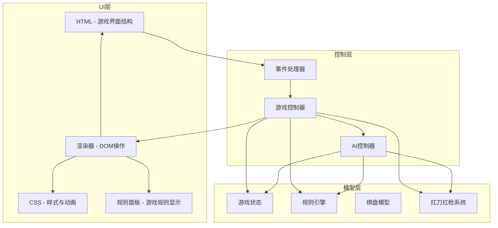
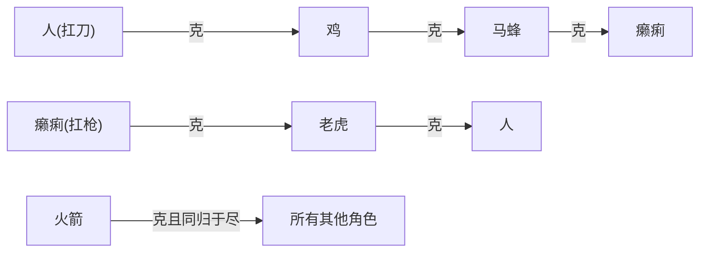

# 设计文档：刀杀鸡（扛刀扛枪版）卡牌游戏

## 概述

刀杀鸡是一款基于4×4棋盘的双人卡牌对战游戏，支持双人本地对战（PVP）和人机对战（PVE）两种模式。游戏使用纯HTML/CSS/JavaScript实现，遵循项目中其他app的结构模式，采用单HTML文件 + CSS文件 + JS文件的组织方式。

核心玩法：红蓝双方各持8张角色牌，通过翻牌、走牌、吃牌、扛刀/扛枪等操作，利用8种角色间的相克关系消灭对方所有棋子以获胜。游戏开始时所有牌背面朝上随机放置，玩家通过翻牌发现角色并确定阵营归属。

与旧版的关键差异：
- 删除强制吃子规则：玩家不再被强制执行吃牌操作
- 新增扛刀/扛枪机制：人扛刀后才能杀鸡，癞痢扛枪后才能杀老虎；刀和枪自身不能移动
- 火箭克一切但同归于尽：火箭可以吃所有角色，但吃完后自身也被消灭；删除"人克火箭"
- PVE模式标识：界面上清楚标识玩家方和电脑方
- 游戏规则面板：棋盘旁空白区域显示游戏规则

技术选型理由：
- 纯HTML/CSS/JavaScript：与项目中其他app保持一致，无需额外构建工具
- 单文件组织：HTML负责结构，CSS负责样式，JS负责游戏逻辑，职责清晰
- 游戏逻辑与UI分离：核心游戏规则（相克关系、扛刀扛枪等）封装为纯函数，便于测试

## 架构

游戏采用MVC-like架构，将游戏状态管理、规则引擎和UI渲染分离：



文件结构：
```
apps/card-game/knife-kills-chicken/
├── images/          # 已有的16张角色图片
├── index.html       # 游戏页面
├── game.css         # 游戏样式
├── game.js          # 游戏主逻辑（状态管理、控制器、渲染、AI）
└── game.test.js     # 单元测试与属性测试
```

设计决策：将所有JS逻辑放在单个`game.js`文件中，通过模块模式组织代码。游戏逻辑的核心纯函数通过`module.exports`导出供测试使用。

## 组件与接口

### 1. 规则引擎（RuleEngine）

负责所有游戏规则的判定，为纯函数集合，不依赖DOM。

```javascript
/**
 * 判断攻击方是否克制防守方
 * 需要考虑扛刀/扛枪状态：
 * - 扛刀人(carrying='刀')克鸡，未扛刀的人不能吃鸡
 * - 扛枪癞痢(carrying='枪')克老虎，未扛枪的癞痢不能吃老虎
 * - 火箭克所有其他角色（同归于尽在captureCard中处理）
 * - 刀和枪自身不能吃任何角色
 * @param {Card} attackerCard - 攻击方卡牌对象（需要role和carrying属性）
 * @param {Card} defenderCard - 防守方卡牌对象
 * @returns {boolean} 是否克制
 */
function canCapture(attackerCard, defenderCard) {}

/**
 * 获取指定棋子的所有合法移动目标
 * 刀和枪在未被扛起时不能移动
 * @param {Board} board - 棋盘状态
 * @param {number} x - 棋子x坐标
 * @param {number} y - 棋子y坐标
 * @returns {Array<{x,y}>} 合法移动目标列表
 */
function getValidMoves(board, x, y) {}

/**
 * 获取指定棋子的所有合法吃牌目标
 * @param {Board} board - 棋盘状态
 * @param {number} x - 棋子x坐标
 * @param {number} y - 棋子y坐标
 * @param {string} team - 当前阵营
 * @returns {Array<{x,y}>} 合法吃牌目标列表
 */
function getValidCaptures(board, x, y, team) {}

/**
 * 获取指定棋子的所有合法扛刀/扛枪目标
 * 人可以扛己方的刀，癞痢可以扛己方的枪
 * @param {Board} board - 棋盘状态
 * @param {number} x - 棋子x坐标
 * @param {number} y - 棋子y坐标
 * @param {string} team - 当前阵营
 * @returns {Array<{x,y}>} 合法扛刀/扛枪目标列表
 */
function getCarryTargets(board, x, y, team) {}

/**
 * 检查当前玩家是否有任何合法操作
 * @param {Board} board - 棋盘状态
 * @param {string} team - 当前阵营
 * @returns {boolean} 是否有合法操作
 */
function hasAnyLegalAction(board, team) {}

/**
 * 检查游戏是否结束
 * @param {Board} board - 棋盘状态
 * @param {string} currentTeam - 当前行动方阵营
 * @returns {{ended: boolean, winner: string|null}} 游戏结束状态
 */
function checkGameOver(board, currentTeam) {}
```


### 2. 游戏状态管理（GameState）

管理整个游戏的状态数据。

```javascript
/**
 * 创建初始游戏状态
 * @param {string} mode - 'pvp' | 'pve'
 * @returns {GameState} 初始状态
 */
function createGameState(mode) {}

/**
 * 执行翻牌操作，返回新状态
 * 第一次翻牌时确定阵营分配：PVE模式下根据aiFirst判断翻牌者是玩家还是AI，
 * 翻牌者控制翻到的牌的阵营。翻牌后currentTeam切换到翻牌者阵营的对方，
 * 确保回合正确交替（避免翻到的牌阵营与currentTeam颜色错位导致连续操作）。
 * @param {GameState} state - 当前状态
 * @param {number} x - 目标x坐标
 * @param {number} y - 目标y坐标
 * @returns {GameState} 新状态
 */
function flipCard(state, x, y) {}

/**
 * 执行走牌操作，返回新状态
 * @param {GameState} state - 当前状态
 * @param {{x,y}} from - 起始位置
 * @param {{x,y}} to - 目标位置
 * @returns {GameState} 新状态
 */
function moveCard(state, from, to) {}

/**
 * 执行吃牌操作，返回新状态
 * 火箭吃牌时触发同归于尽：火箭和被吃方都被移除
 * 扛刀人/扛枪癞痢被吃时，人+刀或癞痢+枪同时被移除
 * @param {GameState} state - 当前状态
 * @param {{x,y}} from - 攻击方位置
 * @param {{x,y}} to - 被吃方位置
 * @returns {GameState} 新状态
 */
function captureCard(state, from, to) {}

/**
 * 执行扛刀/扛枪操作，返回新状态
 * 人移动到己方刀的位置合体，癞痢移动到己方枪的位置合体
 * 合体后棋子在刀/枪原来的位置，人/癞痢原位置变空
 * @param {GameState} state - 当前状态
 * @param {{x,y}} from - 人/癞痢的位置
 * @param {{x,y}} to - 刀/枪的位置
 * @returns {GameState} 新状态
 */
function carryWeapon(state, from, to) {}
```

### 3. AI决策引擎（AIController）

在PVE模式下为电脑方做出决策。

```javascript
/**
 * AI选择最优操作
 * @param {GameState} state - 当前游戏状态
 * @param {string} aiTeam - AI所属阵营
 * @returns {{type: string, from?: {x,y}, to?: {x,y}, x?: number, y?: number}} AI决策结果
 *   type: 'flip' | 'move' | 'capture' | 'carry'
 */
function aiDecide(state, aiTeam) {}
```

AI决策优先级：
1. 存在吃牌机会 → 优先执行吃牌
2. 人/癞痢与己方刀/枪相邻且扛起有战术价值 → 执行扛刀/扛枪
3. 有未翻开的牌 → 随机翻一张
4. 否则 → 随机选一个己方可移动棋子移动到合法位置

### 4. 渲染器（Renderer）

负责将游戏状态渲染到DOM，处理用户交互的视觉反馈。

```javascript
/**
 * 渲染棋盘
 * 扛刀人/扛枪癞痢显示为两张重叠卡片（人/癞痢在下，刀/枪在上）
 * @param {GameState} state - 当前游戏状态
 */
function renderBoard(state) {}

/**
 * 高亮显示选中棋子及其合法目标
 * 目标包括：移动目标、吃牌目标、扛刀/扛枪目标
 * @param {number} x - 选中棋子x坐标
 * @param {number} y - 选中棋子y坐标
 * @param {Array<{x,y}>} moveTargets - 合法移动目标
 * @param {Array<{x,y}>} captureTargets - 合法吃牌目标
 * @param {Array<{x,y}>} carryTargets - 合法扛刀/扛枪目标
 */
function highlightTargets(x, y, moveTargets, captureTargets, carryTargets) {}

/**
 * 渲染游戏规则面板
 * 在棋盘旁边空白区域显示相克关系、扛刀扛枪机制、火箭规则等
 */
function renderRulesPanel() {}

/**
 * 更新PVE模式下的阵营标识
 * 显示"玩家（红方）"和"电脑（蓝方）"等标识
 * @param {GameState} state - 当前游戏状态
 */
function updateTeamLabels(state) {}

/**
 * 显示模式选择界面
 */
function showModeSelection() {}

/**
 * 显示石头剪刀布界面
 * @param {string} mode - 'pvp' | 'pve'
 */
function showRPSSelection(mode) {}

/**
 * 显示游戏结束界面
 * @param {string} winner - 获胜方
 */
function showGameOver(winner) {}
```

### 5. 图片映射

角色名到图片文件名的映射关系：

| 角色名（规则） | 图片文件名前缀 |
|---|---|
| 马蜂 | 胡蜂 |
| 癞痢 | 癞痢 |
| 枪 | 洋枪 |
| 老虎 | 老虎 |
| 人 | 人 |
| 刀 | 刀 |
| 鸡 | 鸡 |
| 火箭 | 火箭 |

特殊说明：红方"人"的图片为`人-人.png`（而非`人-红.png`），蓝方"人"的图片为`人-蓝.png`。

图片路径格式：`images/{图片前缀}-{颜色}.png`，其中颜色为"红"或"蓝"。

## 数据模型

### Card（牌）

```javascript
{
  role: string,           // 角色名：'马蜂'|'癞痢'|'枪'|'老虎'|'人'|'刀'|'鸡'|'火箭'
  team: string,           // 阵营：'red'|'blue'
  faceUp: boolean,        // 是否正面朝上
  carrying: string|null   // 该角色正在扛的武器角色名（'刀'或'枪'），null表示未扛
}
```

扛刀/扛枪状态说明：
- 当人扛起刀后：人的`carrying`设为`'刀'`，刀从棋盘上移除（该位置变为人的新位置，人原位置变空）
- 当癞痢扛起枪后：癞痢的`carrying`设为`'枪'`，枪从棋盘上移除
- 扛刀人被吃时，人和刀都计入被吃列表；扛枪癞痢被吃时，癞痢和枪都计入被吃列表

### Board（棋盘）

4×4二维数组，每个元素为Card或null（空位）：

```javascript
// board[y][x]，y为行(0-3)，x为列(0-3)
Card[][] | null[][]
```

### GameState（游戏状态）

```javascript
{
  mode: string,              // 'pvp' | 'pve'
  board: (Card|null)[][],    // 4×4棋盘
  currentTeam: string,       // 当前行动方：'red'|'blue'
  playerTeam: string|null,   // 玩家阵营（PVE模式下有效）
  aiTeam: string|null,       // AI阵营（PVE模式下有效）
  teamAssigned: boolean,     // 阵营是否已通过翻牌确定
  firstPlayer: string|null,  // 先手玩家标识
  turnCount: number,         // 当前回合数
  capturedRed: string[],     // 红方被吃掉的角色列表
  capturedBlue: string[],    // 蓝方被吃掉的角色列表
  selectedCell: {x,y}|null,  // 当前选中的棋子位置
  gameOver: boolean,         // 游戏是否结束
  winner: string|null,       // 获胜方
  aiThinking: boolean,       // AI是否正在思考（PVE模式）
  aiFirst: boolean           // PVE模式下AI是否先手（用于第一次翻牌时正确分配阵营）
}
```

### 相克关系表（DominanceMap）

新版相克关系（删除了"人克火箭"，人和癞痢的吃牌能力依赖扛刀/扛枪状态）：

```javascript
// 基础相克关系（不考虑扛刀/扛枪状态）
const BASE_DOMINANCE = {
  '马蜂': ['癞痢'],
  '老虎': ['人'],
  '鸡':   ['马蜂'],
  '火箭': ['马蜂', '癞痢', '枪', '老虎', '人', '刀', '鸡']
};

// canCapture 函数中的完整逻辑：
// 1. 刀和枪自身不能吃任何角色 → 直接返回false
// 2. 基础相克：查 BASE_DOMINANCE 表
// 3. 扛刀人克鸡：attackerCard.role === '人' && attackerCard.carrying === '刀' && defenderCard.role === '鸡'
// 4. 扛枪癞痢克老虎：attackerCard.role === '癞痢' && attackerCard.carrying === '枪' && defenderCard.role === '老虎'
// 5. 未扛刀的人不能吃鸡
// 6. 未扛枪的癞痢不能吃老虎
// 7. 火箭克所有其他角色（同归于尽在captureCard中处理）
```

相克关系图：



### 图片映射表（ImageMap）

```javascript
const IMAGE_MAP = {
  '马蜂': '胡蜂',
  '癞痢': '癞痢',
  '枪':   '洋枪',
  '老虎': '老虎',
  '人':   '人',
  '刀':   '刀',
  '鸡':   '鸡',
  '火箭': '火箭'
};

function getImagePath(role, team) {
  const prefix = IMAGE_MAP[role];
  const color = team === 'red' ? '红' : '蓝';
  if (role === '人' && team === 'red') {
    return 'images/人-人.png';
  }
  return `images/${prefix}-${color}.png`;
}
```

### 石头剪刀布（RPS）

```javascript
// 返回: 1=第一方胜, -1=第二方胜, 0=平局
function judgeRPS(choice1, choice2) {}
// choice: 'rock' | 'scissors' | 'paper'
```


## 正确性属性

*属性是一种在系统所有有效执行中都应成立的特征或行为——本质上是关于系统应该做什么的形式化陈述。属性是人类可读规范与机器可验证正确性保证之间的桥梁。*

### 属性 1：棋盘初始化不变量

*对于任意*初始游戏状态，棋盘上应恰好有16张牌，全部`faceUp`为`false`；红蓝双方各8张，每方包含马蜂、癞痢、枪、老虎、人、刀、鸡、火箭各一张。

**验证: 需求 1.2, 1.4, 13.1**

### 属性 2：基础相克关系正确性

*对于任意*攻击方和防守方卡牌组合，`canCapture`的结果应严格符合相克关系表：马蜂克癞痢、老虎克人、鸡克马蜂；且相克关系为单向——若A克B，则B不克A（火箭除外，因为火箭克所有但不被任何角色克）。

**验证: 需求 6.1, 6.6**

### 属性 3：扛刀人克鸡的条件性

*对于任意*人牌和鸡牌的组合，当且仅当人的`carrying === '刀'`时，`canCapture(人, 鸡)`返回`true`；未扛刀的人对鸡返回`false`。

**验证: 需求 6.2**

### 属性 4：扛枪癞痢克老虎的条件性

*对于任意*癞痢牌和老虎牌的组合，当且仅当癞痢的`carrying === '枪'`时，`canCapture(癞痢, 老虎)`返回`true`；未扛枪的癞痢对老虎返回`false`。

**验证: 需求 6.3**

### 属性 5：火箭克所有角色且同归于尽

*对于任意*非火箭角色，`canCapture(火箭, 该角色)`应返回`true`；且当火箭执行吃牌操作后，火箭原位置和被吃方位置均应变为`null`。

**验证: 需求 6.4, 5.6**

### 属性 6：刀和枪的被动性

*对于任意*棋盘状态中独立存在的刀或枪（未被扛起），`canCapture(刀/枪, 任意角色)`应返回`false`，且`getValidMoves`应返回空列表。刀和枪既不能主动吃牌，也不能主动移动。

**验证: 需求 6.5, 4.6**

### 属性 7：合法移动目标均为相邻空位

*对于任意*棋盘上可移动的已翻开棋子，`getValidMoves`返回的所有目标位置与原位置的曼哈顿距离恰好为1，且目标位置为空（`null`）。

**验证: 需求 4.1, 4.2**

### 属性 8：合法吃牌目标均为相邻对方已翻开牌

*对于任意*棋盘上己方已翻开棋子，`getValidCaptures`返回的所有目标位置与原位置的曼哈顿距离恰好为1，目标位置的牌为已翻开的对方阵营牌，且攻击方克制防守方。

**验证: 需求 5.5**

### 属性 9：扛刀/扛枪操作的状态正确性

*对于任意*合法的扛刀/扛枪操作，执行`carryWeapon`后：扛者（人/癞痢）出现在武器（刀/枪）原来的位置且`carrying`字段正确设置，扛者原位置变为`null`；且只允许扛起己方阵营的武器。

**验证: 需求 7.1, 7.2, 7.3, 7.4, 7.5**

### 属性 10：扛着角色被吃时同时移除两张牌

*对于任意*扛刀人或扛枪癞痢被对方吃掉的情况，被吃方的`capturedRed/Blue`列表应同时包含扛者和武器两个角色名（人+刀 或 癞痢+枪）。

**验证: 需求 7.6, 7.7**

### 属性 11：吃牌操作的状态转换正确性

*对于任意*合法的非火箭吃牌操作，执行`captureCard`后：被吃位置变为攻击方卡牌，攻击方原位置变为`null`，被吃角色被加入对应阵营的被吃列表。

**验证: 需求 5.2**

### 属性 12：操作后回合切换

*对于任意*合法操作（翻牌、走牌、吃牌、扛刀/扛枪），执行后`currentTeam`应切换为对方阵营。对于非首次翻牌的操作，`currentTeam`从`'red'`切换为`'blue'`或从`'blue'`切换为`'red'`。对于PVE模式的首次翻牌，`currentTeam`切换为翻牌者阵营的对方（确保翻牌后轮到对手行动）。

**验证: 需求 3.3, 4.4, 5.4, 10.2**

### 属性 13：扛着状态在移动中保持

*对于任意*`carrying`非`null`的角色执行`moveCard`后，移动后的卡牌`carrying`字段应与移动前相同。

**验证: 需求 4.7**

### 属性 14：第一次翻牌确定阵营

*对于任意*初始游戏状态（`teamAssigned === false`），执行第一次翻牌后，`teamAssigned`应变为`true`，且翻牌玩家的阵营应与被翻牌的预分配阵营一致。在PVE模式下，根据`aiFirst`字段判断翻牌者是玩家还是AI：若`aiFirst`为`false`则玩家控制翻到的牌的阵营，若`aiFirst`为`true`则AI控制翻到的牌的阵营。

**验证: 需求 13.2, 13.4**

### 属性 15：AI决策合法性

*对于任意*非游戏结束的游戏状态，`aiDecide`返回的操作应为合法操作（操作类型为`flip/move/capture/carry`之一，且目标位置合法）；当存在吃牌机会时，AI应优先选择吃牌操作。

**验证: 需求 15.1, 15.2, 15.6**

### 属性 16：图片路径映射正确性

*对于任意*角色和阵营的组合，`getImagePath`返回的路径应符合`images/{映射前缀}-{颜色}.png`格式（红方人的特殊情况为`images/人-人.png`），且映射前缀与IMAGE_MAP表一致。

**验证: 需求 3.2**

### 属性 17：石头剪刀布判定正确性

*对于任意*两个有效选择（rock/scissors/paper），`judgeRPS`应满足：相同选择返回0；石头胜剪刀、剪刀胜布、布胜石头返回1；反之返回-1。

**验证: 需求 2.2, 2.3**

## 错误处理

### 非法操作处理

| 错误场景 | 处理方式 |
|---|---|
| 点击空位（无牌） | 忽略点击，无反馈 |
| 点击对方已翻开的牌（非吃牌目标） | 显示提示"只能操作己方棋子" |
| 尝试移动未翻开的牌 | 显示提示"请先翻开该牌" |
| 尝试移动刀或枪 | 显示提示"刀/枪不能主动移动" |
| 尝试吃不克制的对方牌 | 显示提示"无法吃掉该棋子" |
| 未扛刀的人尝试吃鸡 | 显示提示"需要先扛刀才能杀鸡" |
| 未扛枪的癞痢尝试吃老虎 | 显示提示"需要先扛枪才能杀老虎" |
| 尝试扛对方阵营的武器 | 显示提示"只能扛起己方的武器" |
| AI思考中玩家点击 | 忽略点击，界面显示"电脑思考中..." |
| 游戏已结束时点击棋盘 | 忽略点击 |

### 边界情况

| 边界情况 | 处理方式 |
|---|---|
| 棋盘上只剩未翻开的牌 | 当前玩家只能翻牌 |
| 己方所有牌都是刀/枪且未被扛起 | 判定当前方无合法操作，对方获胜 |
| 火箭吃掉扛刀人/扛枪癞痢 | 火箭同归于尽，同时移除火箭+人+刀（或癞痢+枪） |
| 双方同时只剩火箭 | 一方火箭吃另一方火箭，同归于尽，执行吃牌的一方获胜（因为是主动操作） |
| 扛刀人/扛枪癞痢被火箭吃 | 火箭同归于尽，三张牌都被移除 |
| PVE模式电脑先手 | 游戏开始后自动触发AI翻牌，无需玩家操作 |
| PVE首次翻牌阵营与currentTeam颜色错位 | flipCard根据aiFirst正确分配阵营，并将currentTeam设为翻牌者阵营的对方，避免连续操作 |

## 测试策略

### 测试框架

- 单元测试和属性测试：使用 **Vitest** + **fast-check**（项目已安装）
- 测试文件：`apps/card-game/knife-kills-chicken/game.test.js`

### 属性测试（Property-Based Testing）

每个属性测试至少运行 **100次迭代**，使用 fast-check 生成随机输入。

每个属性测试必须用注释标注对应的设计文档属性：
```javascript
// Feature: knife-kills-chicken-game, Property 1: 棋盘初始化不变量
```

属性测试覆盖的核心纯函数：
- `canCapture(attackerCard, defenderCard)` → 属性 2, 3, 4, 5, 6
- `getValidMoves(board, x, y)` → 属性 6, 7
- `getValidCaptures(board, x, y, team)` → 属性 8
- `getCarryTargets(board, x, y, team)` → 属性 9
- `createGameState(mode)` → 属性 1
- `captureCard(state, from, to)` → 属性 5, 10, 11
- `carryWeapon(state, from, to)` → 属性 9
- `moveCard(state, from, to)` → 属性 12, 13
- `flipCard(state, x, y)` → 属性 12, 14
- `aiDecide(state, aiTeam)` → 属性 15
- `getImagePath(role, team)` → 属性 16
- `judgeRPS(choice1, choice2)` → 属性 17

### 单元测试（Example-Based）

单元测试覆盖以下场景：
- 模式选择流程（PVP/PVE）
- 石头剪刀布平局重试
- UI渲染：扛刀人/扛枪癞痢的两层卡片显示
- PVE模式阵营标识显示
- 规则面板内容完整性
- AI操作延迟和高亮反馈
- 非法操作提示信息
- 游戏结束界面和重新开始流程

### 测试数据生成策略

使用 fast-check 的 arbitrary 生成器：

```javascript
// 角色生成器
const roleArb = fc.constantFrom('马蜂', '癞痢', '枪', '老虎', '人', '刀', '鸡', '火箭');

// 阵营生成器
const teamArb = fc.constantFrom('red', 'blue');

// 卡牌生成器（含carrying状态）
const cardArb = fc.record({
  role: roleArb,
  team: teamArb,
  faceUp: fc.boolean(),
  carrying: fc.constantFrom(null, '刀', '枪')
}).filter(card => {
  // 只有人可以carrying='刀'，只有癞痢可以carrying='枪'
  if (card.carrying === '刀') return card.role === '人';
  if (card.carrying === '枪') return card.role === '癞痢';
  return true;
});

// 棋盘生成器（4×4，含null空位）
const boardArb = fc.array(
  fc.array(fc.option(cardArb, { nil: null }), { minLength: 4, maxLength: 4 }),
  { minLength: 4, maxLength: 4 }
);

// RPS选择生成器
const rpsArb = fc.constantFrom('rock', 'scissors', 'paper');
```
